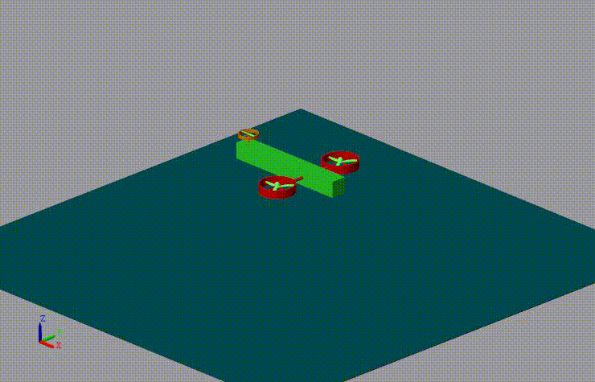
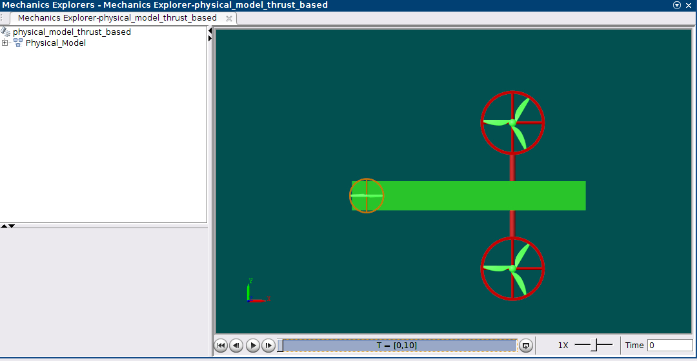
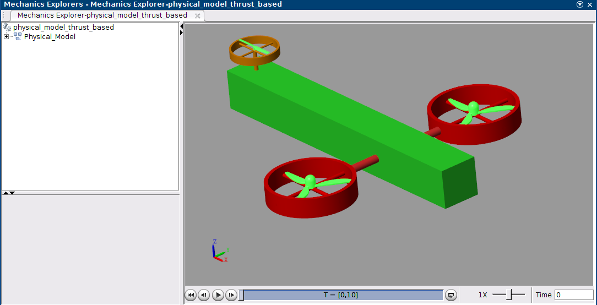

# Simscape/Simulink Model of Rotary-Tilting-Wing Robot

This repository provides a brief description of the developed Simscape/Simulink models for a rotary-tilting-wing robot system.

  

## Overview

This model represents a simplified version of the rotary-tilting-wing robot. The system consists of:

- A base (green).

- Two side rotor assemblies.

- A tail rotor assembly.

- A ground plane for stable initialization and controlled stops.

## Inputs

- Rotational speeds of the left and right side rotors (rad/s).

- Rotational speed of the tail rotor (rad/s).

- Tilt angles of the rotors (rad).

## Outputs

- Rotational and translational states in the world reference frame.

## The model includes:

- A configuration block with gravity set to 9.81 m/s².

- A world reference frame block.

- A six-DOF block enabling free movement in 3D space.

- A ground stop for altitude control.

## How to Run the Simulink

Ensure the .STL files for the propellers (e.g., SideRotor.stl and TailRotor.stl) in the CAD folder are loaded correctly. Load these files into the appropriate solid blocks, such as PropL for the left rotor. When running the Simulink model, the Mechanic Explorer window will display the system.

  

  

## How to Change Model Parameters

To modify the initial altitude of the robot:

- Double-click the "Ground Stop" block.

- Change the "initial altitude" value (default: 2 meters).
